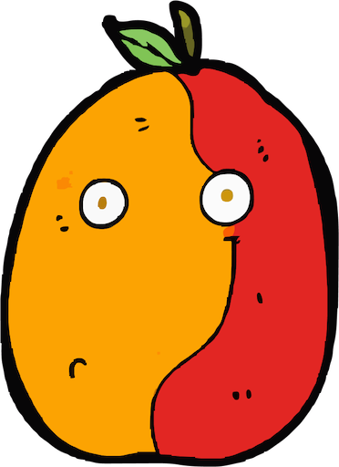
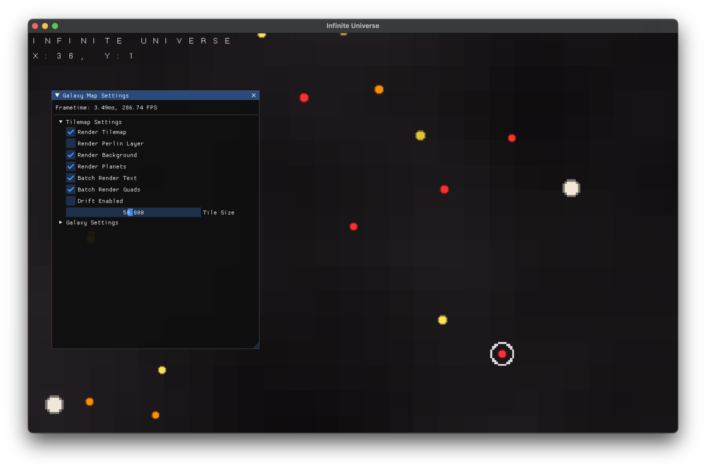
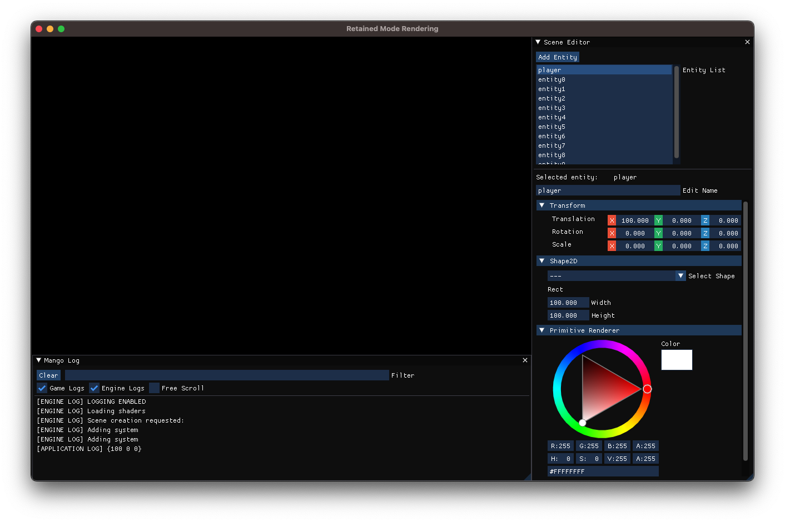

# Mango

<p align="center">
    
</p>

## About

Mango is a cross-platform, data-driven game engine written in Go. The engine is built with simplicity and usability in mind. As a result, Mango offers both an [immediate mode](./im/im.go) rendering system as well as a retained mode rendering system. This allows developers build simple games faster while also providing the ability switch between render systems as a project grows more complex.

**Warning**: Mango is in extremely early stages. I would advise against using it to build a game but if you want to see how this might work, the Immediate Mode system is pretty usable. See [examples](./example/ecs/main.go).

<p align="center">
    
</p>

## Features

These are Mango's mean features so far:

- Immediate Mode Render System
  - Primitives: Quad, Circle, Sprite, Line, etc
  - Batched Renderers: Quad, Pixel
- Bitmap Font Rendering
- Entity Component System (in progress)
- UV Spritemap System
- Input
- Debug Tools
  - In-Game Logging System
- `imgui` integration
  - Ability to create debug tools for your game

## Usage

### Default Mode

Coming soon...

### Immediate Mode

Using Mango's immediate mode rendering system is extremely easy and requires minimal work:

```go
import "github.com/micahke/mango"

func main() {

    // Initialize the engine and specify immediate mode rendering
    mango.Init(core.RENDER_MODE_IM)

    // Create a new window with vsync enabled
    mango.CreateWindow(800, 600, "TITLE", true)

    mango.IM.ConnectScene(&Game{})
    mango.Start()

}
```

Immediate mode scenes only need to implement 3 simple methods for this to work:

```go
type Game struct {}

func (game *Game) Init() {}

func (game *Game) Update() {}

func (game *Game) Draw() {

    mango.IM.DrawRect(0, 0, 100, 100)

}
```

## Contributing

If you are looking to contribute to the project, start here. Simply clone the repo and run:

```bash
git clone https://github.com/micahke/mango.git
cd mango
```

**Warning**: Mango relies on GLFW and OpenGL to handle window creation and graphics. Please make sure these libraries are installed on your machine.

<p align="center">
    
</p>
